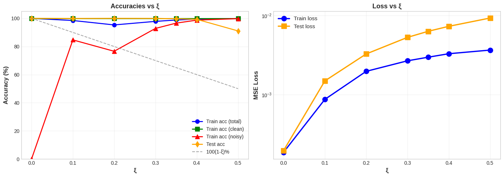
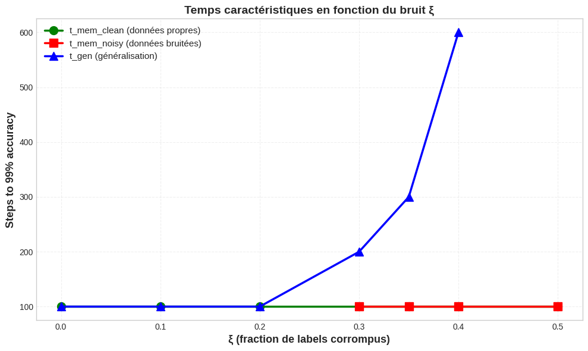
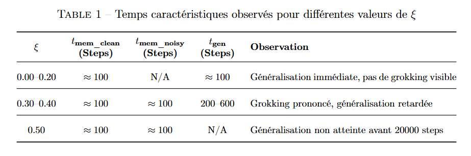
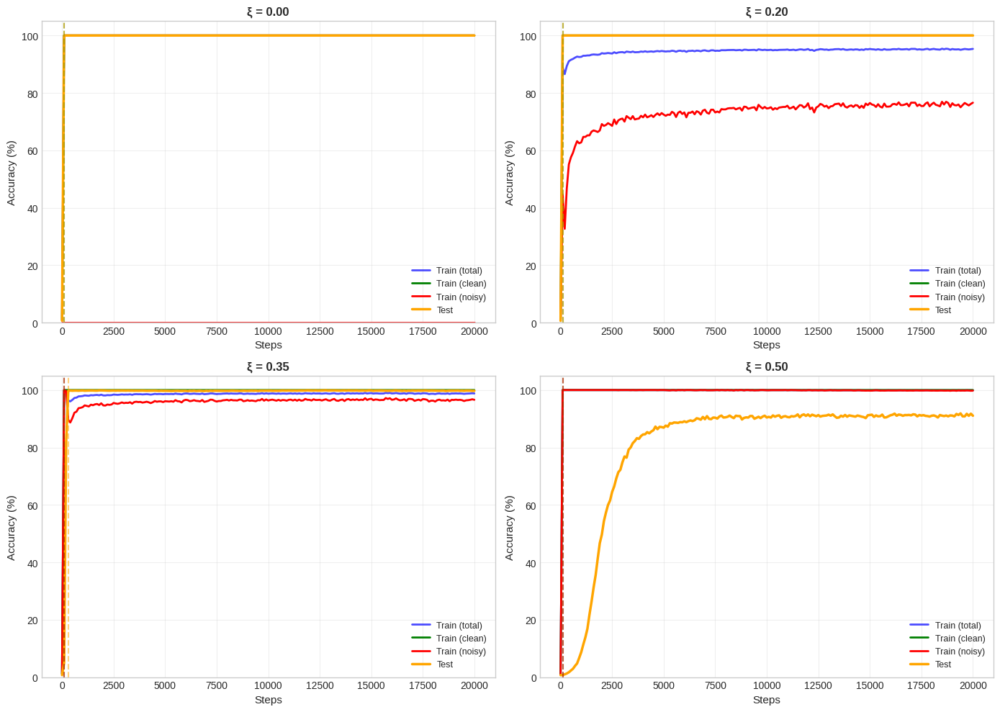
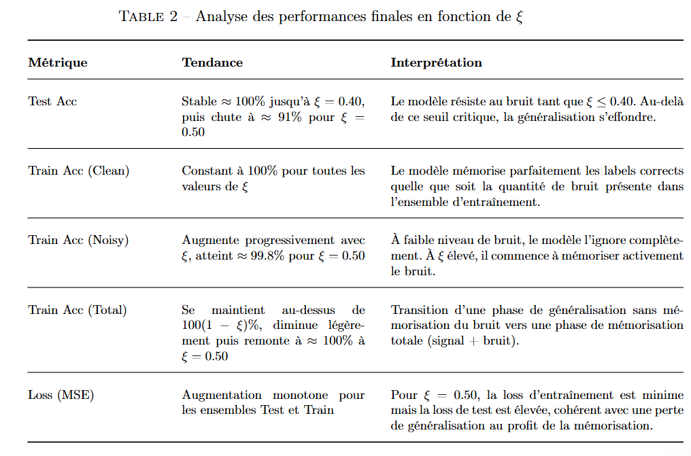

# Analyse des Dynamiques de Grokking en Présence de Bruit ($\xi$)

## Introduction

Ce projet étudie l'impact de la **fraction de labels corrompus** ($\xi$) sur la dynamique d'apprentissage d'un **MLP quadratique** entraîné sur une tâche simple (addition modulaire $m+n \pmod{p}$).

L'objectif principal est de quantifier comment le bruit affecte :

1. **La Mémorisation** : Le temps ($t_{\text{mem}}$) nécessaire pour que le modèle mémorise les données d'entraînement (propres et bruitées).
2. **La Généralisation (Grokking)** : Le temps ($t_{\text{gen}}$) nécessaire pour que le modèle généralise à l'ensemble de test, souvent bien après la mémorisation de l'ensemble d'entraînement.
3. **Les Performances** : Les métriques finales (Accuracy et Loss) sur les ensembles d'entraînement et de test.

## Résultats Clés en Fonction de $\xi$

L'analyse révèle une forte corrélation entre l'augmentation du bruit ($\xi$) et l'évolution de la dynamique d'apprentissage, en particulier la **phase de grokking**.

### 1. Temps de Mémorisation et de Généralisation

  

  

  

**Impact du bruit sur $t_{\text{gen}}$** : La courbe bleue ($t_{\text{gen}}$) montre une augmentation exponentielle lorsque $\xi$ dépasse $0.2$, illustrant que le **coût en temps d'entraînement pour extraire la règle générale augmente considérablement** avec le bruit.

### 2. Performances Finales

  

  

## Phénomène d'Inversion (Grokking)

Les courbes d'entraînement pour $\xi=0.20$ et $\xi=0.35$ illustrent clairement le grokking :

- **Mémorisation Rapide** : L'accuracy d'entraînement (bleu) et l'accuracy des données propres (vert) atteignent rapidement $100\%$ (autour de $100$ steps).
- **Généralisation Retardée (Grokking)** : L'accuracy de test (orange) reste faible pendant un certain temps (phase de mémorisation), puis **grimpe soudainement** (phase de généralisation/grokking) aux temps $t_{\text{gen}}$ indiqués.
- **Mémorisation vs. Généralisation** : L'écart entre le moment où l'erreur d'entraînement s'approche de zéro et le moment où la généralisation s'améliore est la signature du grokking. L'augmentation de $\xi$ amplifie cet écart (augmente $t_{\text{gen}}$).

## 🧐 Interprétation : Le Rôle de la Régularisation

Le fait que le modèle parvienne à mémoriser les données propres ($t_{\text{mem\_clean}} \approx 100$) tout en retardant la généralisation démontre qu'il **privilégie l'apprentissage de la règle générale** (qui est la solution pour les données propres) **plutôt que la mémorisation superficielle des labels bruités** (qui augmente la loss de test).

L'utilisation d'une forte régularisation ($\text{weight\_decay}=1.0$) semble encourager le réseau à trouver cette structure simple et généralisable, lui permettant de **passer outre le bruit** jusqu'à un certain seuil ($\xi \approx 0.40$). Au-delà de ce seuil, le bruit devient trop dominant, le modèle mémorise tout, et la généralisation s'effondre.

## Conclusions

1. **Seuil critique** : Le modèle tolère jusqu'à $\xi \approx 0.40$ de labels corrompus avant que la généralisation ne soit compromise.
2. **Transition de phase** : Entre $\xi=0.20$ et $\xi=0.40$, on observe une transition d'une généralisation rapide vers un grokking prononcé.
3. **Effondrement** : À $\xi=0.50$, le modèle ne parvient plus à extraire la règle sous-jacente dans un temps raisonnable.

## 🔬 Perspectives

- Étudier l'impact d'autres hyperparamètres (taux d'apprentissage, architecture) sur ces dynamiques.
- Explorer des stratégies de détection et de filtrage du bruit pour améliorer la robustesse.
- Analyser les représentations internes pour comprendre comment le modèle distingue signal et bruit.

**Auteur** : Balbino Tchoutzine
**Date** :  Novelbre 2025  
**Licence** : MIT
